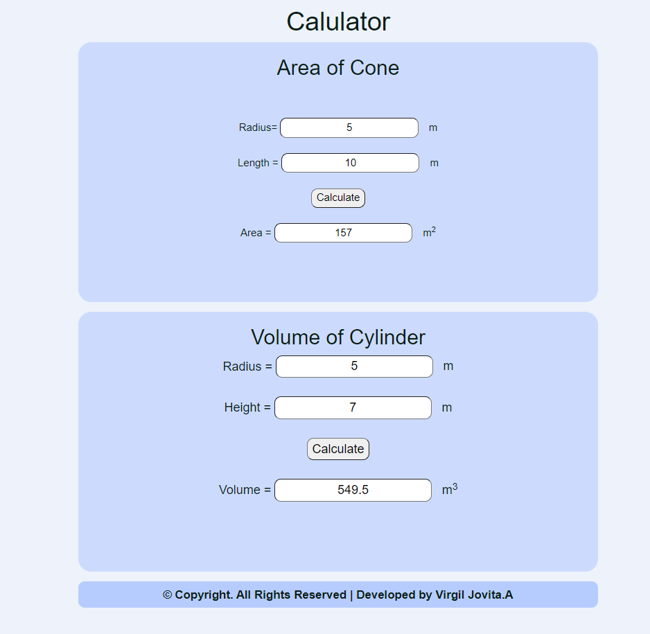

# AngularCalculation

# Web Page for Mathematical Calculations using Angular

## AIM:
To design a dynamic website to perform mathematical calculations using Angular Framwork

## DESIGN STEPS:

### Step 1:

Requirement collection.

### Step 2:

Creating the layout using HTML and CSS in component.html file

### Step 3:

Write typescript to perform the calculations.

### Step 4:

Validate the layout in various browsers.

### Step 5:

Validate the HTML code.

### Step 6:

Publish the website in the given URL.

## PROGRAM :
### app.component.html:
```
<body>
  <div class="container">
  <h1>Calulator</h1>
  <div class="content">
      <h2 class="padding">Area of Cone</h2>
      <Cone-Area class="forms, padding" ></Cone-Area>
  </div>
  <div class="content1">
      <h2>Volume of Cylinder</h2>
      <Cylinder-Volume class="forms"></Cylinder-Volume>
  </div>
  <div class="footer">
    &copy; Copyright. All Rights Reserved | Developed by Virgil Jovita.A
  </div>
  </div>
</body>
```
### styles.css:
```
*{
    box-sizing: border-box;
    font-family: Arial, Helvetica, sans-serif;
    }
    
    body{
        background-color: #edf2fb;
        color: #081c15;
    }
    
    .container{
        text-align: center;
        width: 1080px;
        height: 850px;
        margin-left: auto;
        margin-right: auto;
        margin-top: auto;
    }
    
    .content{
        display: block;
        width: 100%;
        margin-left: auto;
        margin-right: auto;
        background-color: #ccdbfd;
        height: 400px;
        width: 800px;
        text-align: center;
        border-radius: 20px;
    }
    
    .padding{
        padding-bottom: 50px;
    }
    .content1{
        display: block;
        width: 100%;
        margin-left: auto;
        margin-right: auto;
        background-color: #ccdbfd;
        margin-top: 15px;
        height: 400px;
        width: 800px;
        border-radius: 20px;
    }
    
    h1{
        color: #081c15;
        text-align: center;
        padding-top: 20px;
    }
    
    h2{
        color: #081c15;
        text-align: center;
        padding-top: 20px;
    }
    a{
        padding-left: 1pc;
    }
    input{
        border-radius: 10px;
        text-align: center;

    }

    .forms{
        text-align: center;
        padding-top: 20px;
        font-size: larger;
    }
    
    .footer{
        font-weight: 600;
        margin-top: 15px;
        display: inline-block;
        height: 40px;
        width: 800px;
        background-color: #b6ccfe; 
        text-align: center;
        padding-top: 7px;
        font-size: large;
        border-radius: 10px;
    }
```
### cone.component.html:
```
<div>
    Radius= <input type="text" [(ngModel)]="radius"><a>m</a><br/>
    <br/>
    Length = <input type="text" [(ngModel)]="length"><a>m</a><br/>
    <br/>
    <input class="button" type="button" value="Calculate" (click)="onCalculateArea()"><br/>
    <br/>
    Area = <input type="text"  [value]="area"><a>m<sup>2</sup></a>
</div>
```
### cone.component.js:
```
import { Component } from "@angular/core";

@Component({
    selector:"Cone-Area",
    templateUrl:"./cone.component.html"
})
export class ConeComponent{
    radius:number;
    length:number;
    area: number;
    constructor(){
        this.radius = 0;
        this.length = 0;
        this.area = 3.14*this.radius*this.length
    }
    onCalculateArea(){
        this.area = 3.14*this.radius*this.length   
    }
}
```
### cylinder.component.html:
```
<div>
    Radius = <input type="text" [(ngModel)]="radius"><a>m</a><br/>
    <br/>
    Height = <input type="text" [(ngModel)]="height"><a>m</a><br/>
    <br/>
    <input class="button" type="button" value="Calculate" (click)="onCalculateVolume()"><br/>
    <br/>
    Volume = <input type="text"  [value]="volume"><a>m<sup>3</sup></a>
</div>
```
### cylinder.component.js:
```
import { Component } from "@angular/core";

@Component({
    selector:"Cylinder-Volume",
    templateUrl:"./cylinder.component.html"
})
export class CylinderComponent{
    radius:number;
    height:number;
    volume: number;
    constructor(){
        this.radius = 0
        this.height = 0
        this.volume = 3.14 * (this.radius**2) * this.height
    }
    onCalculateVolume(){
        this.volume = 3.14 * (this.radius**2) * this.height
    }
}
```
## OUTPUT:
### Home Page(with default input):

### Home Page(with user input):

## Result:
A dynamic website to perform mathematical calculations is designed using Angular Framwork